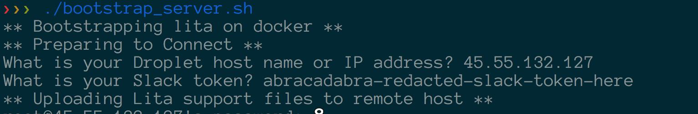
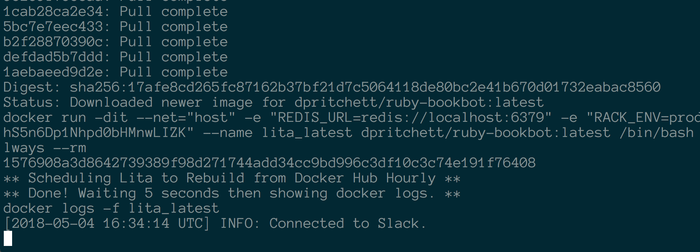

# Run your Lita chatbot on Digital Ocean using Docker

What you need: 

- A Slack API token
- A modest Digital Ocean VPS running the latest Docker-compatible easy distribution. This was the "Docker 17 on 16.04" droplet type as of May 2018:


## How to run this:

Download the repo and run the bootstrap script:

```sh
git clone https://github.com/dpritchett/chatbot-up-and-running.git`
cd chatbot-up-and-running

./bootstrap_server.sh
```

You'll be prompted for the droplet IP address/hostname and your Slack token up front:


The process should run for a couple of minutes and then end with you happily running your own bot:


## Note on SSH access:

If you don't have an SSH agent running on your local box you'll need to type in your DO root password a handful of times while stepping through the bootstrap script. I recommend you get your Droplet created with your public key so you can skip all of that.

## Notes on robustness

This script is almost certainly not going to work forever for everyone. No worries though, you can dig into the bootstrap scripts and Makefile here in the repo to figure out where you went wrong. Feel free to @me on Twitter if you get stuck. There will be a long-form explanation of what all's going on here in my forthcoming book on Ruby chatbots 🤖
