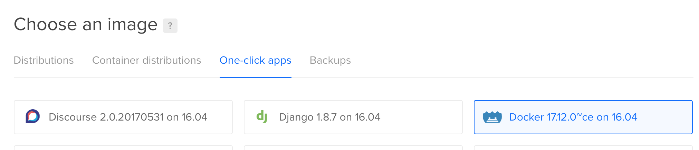

# Run your Lita chatbot on Digital Ocean using Docker

What you need: 

- A Slack API token
- A modest Digital Ocean VPS running the latest Docker-compatible easy distribution. This was the "Docker 17 on 16.04" droplet type as of May 2018.

